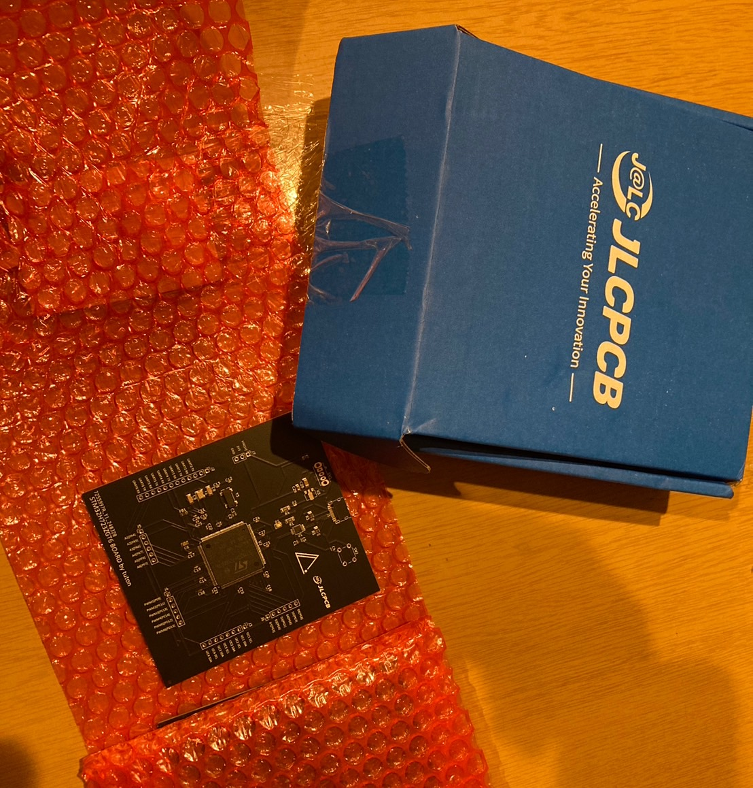
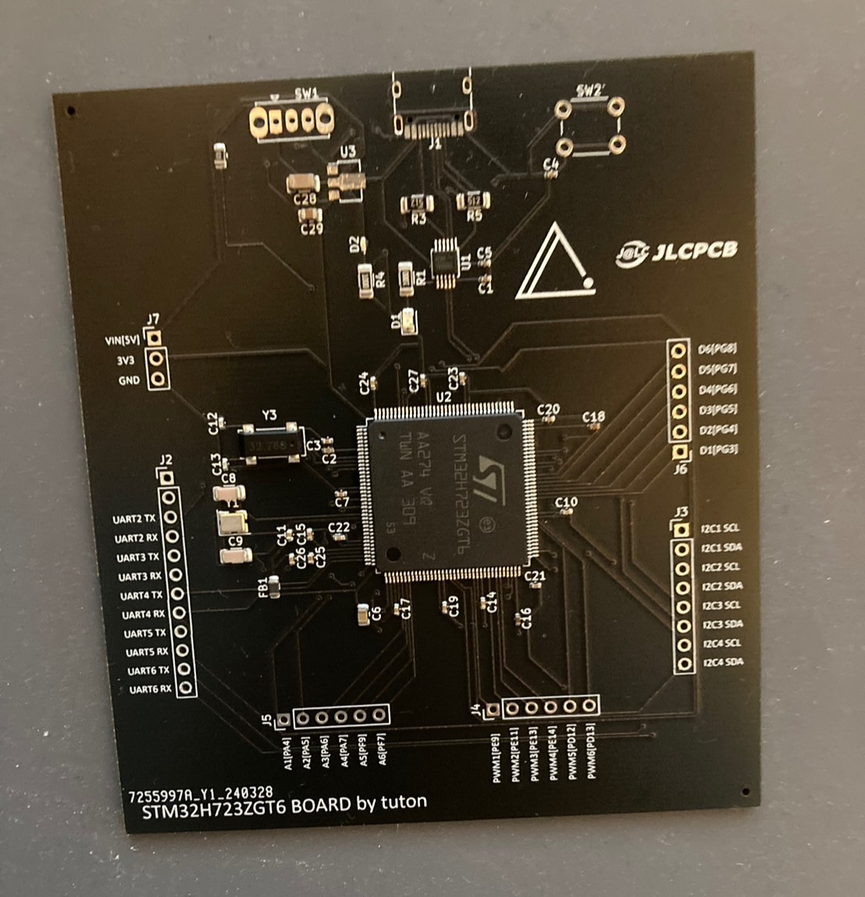

こんにちは、回路担当のshujiです。

# スポンサーの紹介

このたび、ツートンはJLCPCB様にスポンサーになっていただくことになりました。

プリント基板やCNCなどを発注していただく予定です。とても感謝しています。

JLCPCBさんの名前を基板にのせて優勝をつかみにいきます！

# 基板発注！

さっそく基板を注文しました！

今回注文したのは今年のメインマイコンに使う予定のSTM32H723ZGT6のテスト基盤です。

発注から１週間ほどたったころ丁寧な梱包でとどきました。

このJLCPCBの青い箱を見るとテンション上がりますね！

基板の方もかっこよく仕上がっていました！今回は部品実装もお願いしたのですが、すべてきれいに実装してあって感動しました。

（メインマイコンの向きを間違えて発注してしまい手はんだで付け直したのは内緒......）

JLCPCB様の名に恥じぬようかっこいい基板を設計できるようになりたいです。

# まとめ

実は今回の注文までにいろいろあったのですが、JLCPCBさんは丁寧にサポートしてくれて感謝の気持ちでいっぱいです。

プリント基板を発注しようと考えている人にはぜひJLCPCBをおすすめしたいです。

[こちら(https://jlcpcb.com/JPV)](https://jlcpcb.com/JPV)がJLCPCBさんのホームページです。

最近日本語にも対応したみたいです。

また進捗があったらブログを更新していくのでよろしくおねがいします～