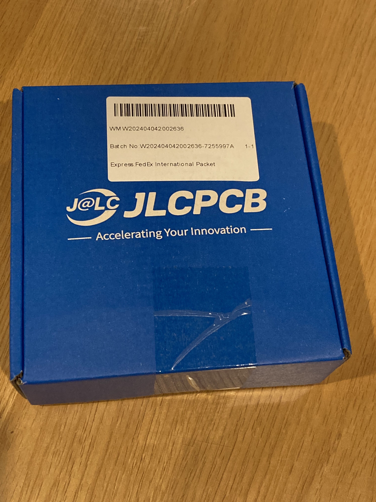
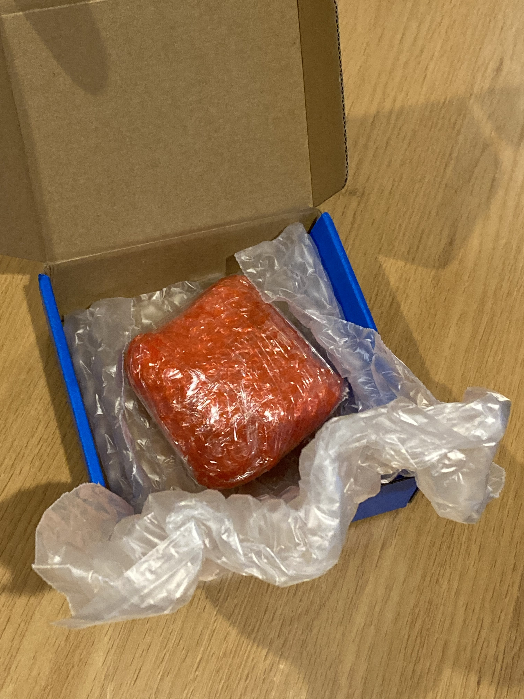
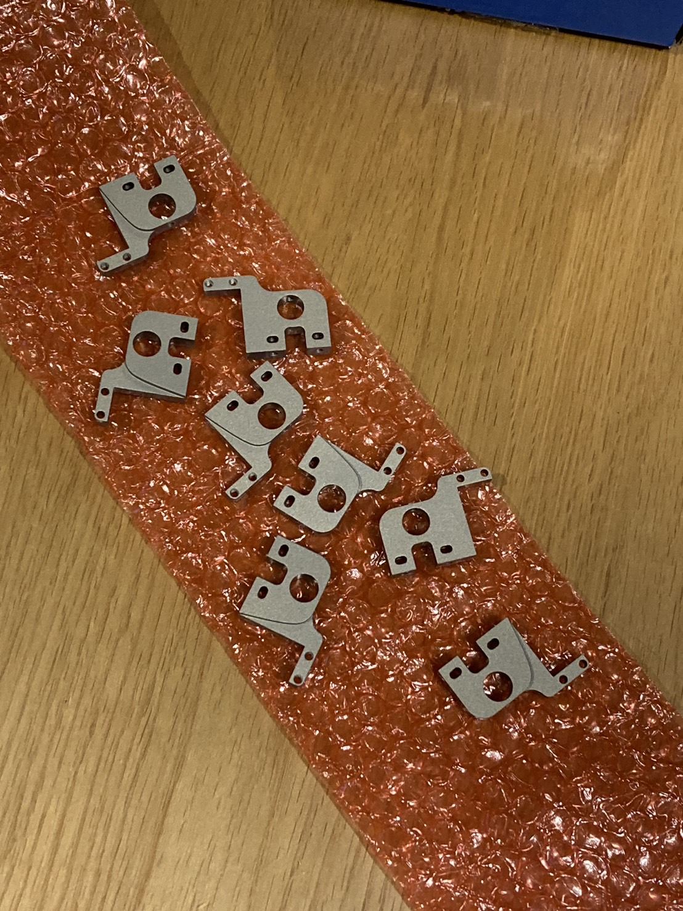
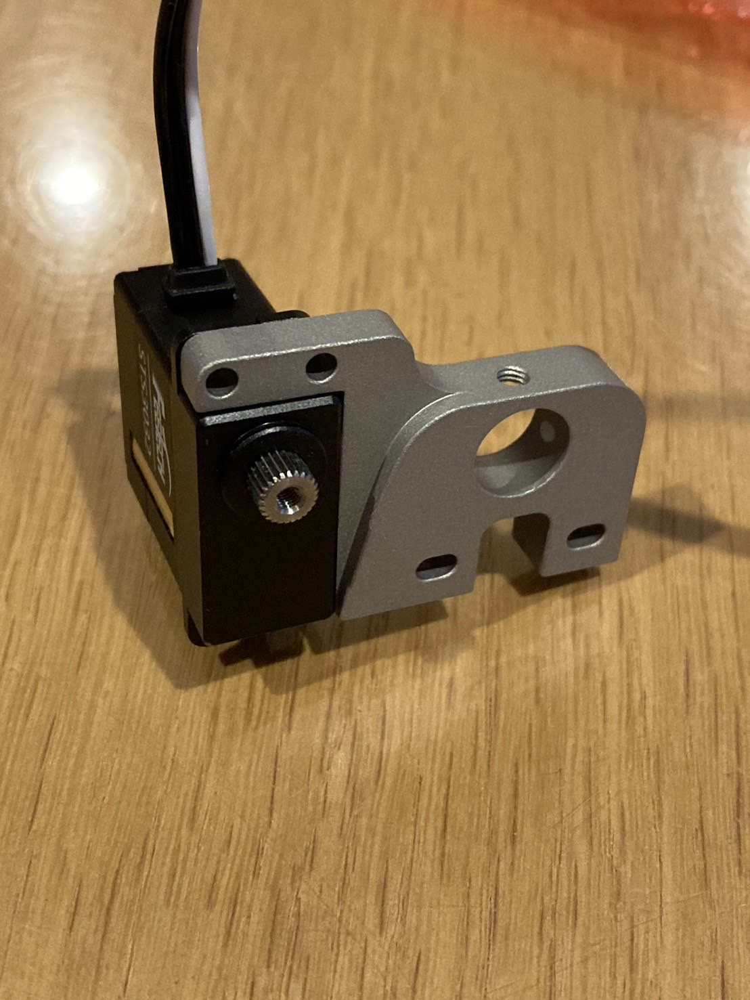
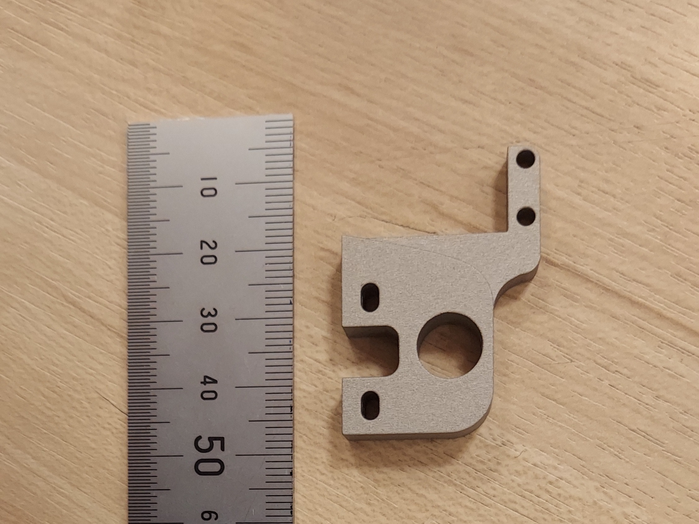
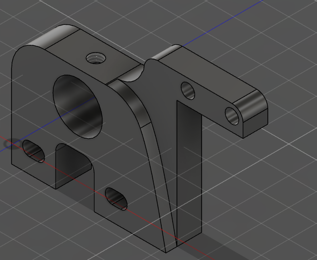
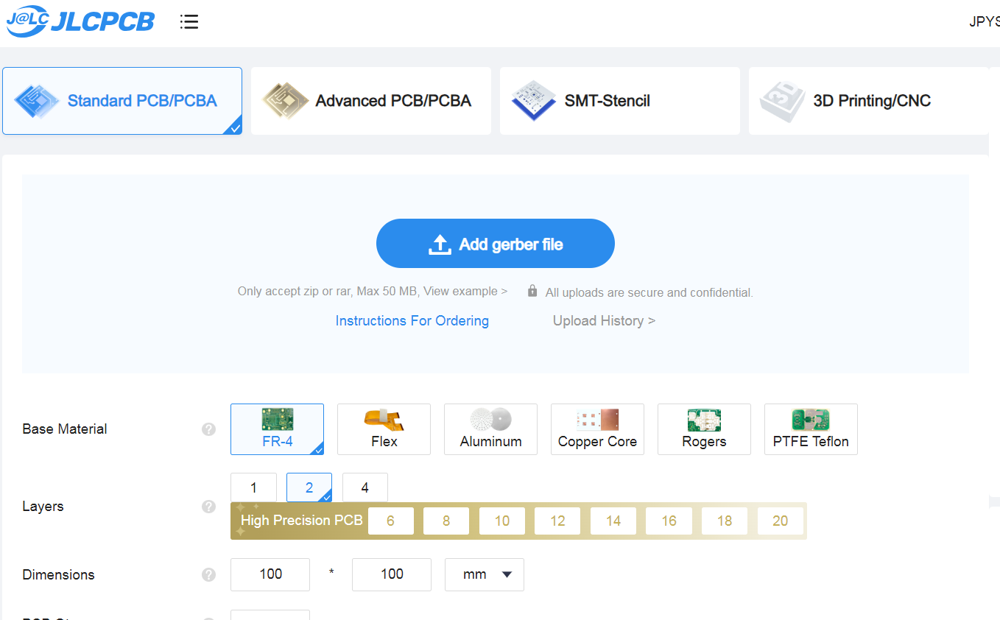
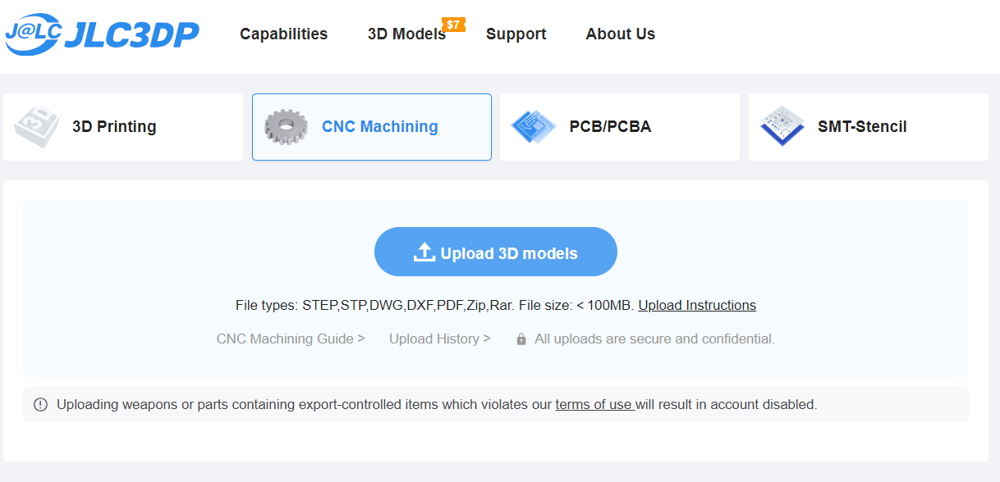
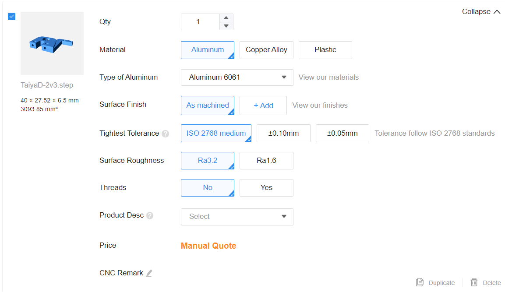

こんにちは、ハード担当のkapiです。

今回はスポンサー企業であるJLCPCB様にロボットで使うCNCの部品を作っていただきました。

# スポンサーの紹介

前回の内容と被ってしまいますがスポンサーの紹介をさせていただきます。

[JLCPCBさんのホームページはこちら(https://jlcpcb.jp/)](https://jlcpcb.jp/)

JLCPCBさんは中国にある基盤のプロトタイプ製作からCNC加工、3Dプリンター印刷まで幅広くいろいろなことをやってくださる企業です。

標準サイズの基板なら5枚で$2から製作できるなど非常に低価格なのが魅力です。また、安い送料プランも用意されており、日本にも迅速に配送できます。

低価格ながら品質は申し分なく、個人の電子工作や競技ロボットにもってこいの企業です。

これからもよろしくお願いします。

# CNC発注

本題です。

今回は足回りに使う金属製の部品をCNCで発注しました。

発注から２週間ほどでとどきました。ねじを切ってもらったり複雑なことをしてもらったのにとても早くて感謝です。

今回注文したのは今年のロボカップジュニアで使うロボットの足回りのパーツです。

STS3032（モータ）とタイヤの軸の固定をします。

[たのロボ！のしろくまさんの設計](https://blog.shirokuma89.dev/20240328/)を参考にさせていただきました。質問にも丁寧に答えてくださって本当にありがとうございます。

表面処理までやってもらったのでとてもかっこよく仕上がっていました。寸法もバッチリです。

ちなみに表面処理はアルマイト加工をしてもらいました。

# 発注の仕方

PCBに比べてCNCの発注はあまり多くないと思うので、JLCPCBさんにCNCを発注するときの手順について書いていきたいと思います。

## ①CADデータを作る

僕はFusion360で作りました。

普通はこの次にCAMを作る必要があるのですが、JLCPCBさんで発注する場合CAMファイルをつくるのはJLCPCBさんがやってくれます。~~CAM作るのがめんどいからうれしいかった~~　なので僕みたいな人でも簡単にできます。

## ②データーをJLCPCBさんに送って見積を作ってもらう

いつもの画面です。今回はCNCを選ぶので一番右の「3D Printing/CNC」を選択します。

するとJLC3DPというサイトに飛びます。

メニューでCNCを選び、Upload 3DmodelsからSTEPファイルなどを開きます。

するとこのように素材や表面処理などを選ぶことができます。

表面処理はアルマイト処理をはじめとしたいろいろな処理を選ぶことができます。いくつか組み合わせることも可能です。

「Threads」はねじ穴加工です。もしねじ穴加工をしてもらう場合にはここをYesにし、図面のPDFファイルをアップロードします。

> PDFの図面にはねじの詳細(ねじの種類、ピッチ、直径など)まで書きましょう。 
> 一度直径のみしか書いていない状態で出してしまい注意されました。

「Product Desc」はプロダクトの説明です。貿易の関係で商品説明が必要なようです。そこまで真剣に悩まなくてもいいと思うのでそれっぽいものを選びましょう。

今回は「Irregular shape Category」の「Aluminum Alloy Bracket - HS Code 761699」を選択しました。

## ③見積を確認する

CNC加工では見積（Quote）をしないと金額がわかりません。②が終わったら「Request a Quote」で見積を取りましょう。

今回は意外とすぐ（15分もしないうちに）見積もりが返ってきましたが場合によって待つ時間は結構変わるかもしれません。

## ④注文する

見積もりが帰ってきたら注文しましょう！このあたりはPCBなどとほぼ同じです。

## ⑤届くのを待つ

発注してから2週間ほどでとどきました。PCBよりは時間がかかってしまいますがとても早くて便利です。(注文してから届くまでがいつも待ち遠しいのは内緒。)

# 最後に

CNC加工には3Dプリンタにはない強度とかっこよさがあるので必要なところにしっかり使っていきたいです。

次はまたCNCでギヤなどを発注したいと思います。

ハードがだんだんできていくぞ......!

 